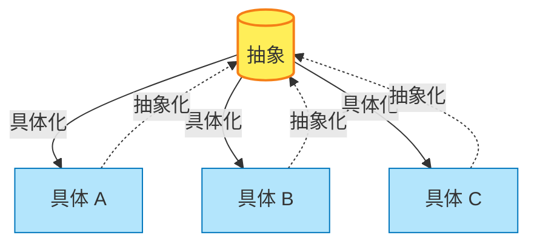

## 読んで得られた学び

具体と抽象の行き来を意識的に行うことで、思考力やコミュニケーション能力を高められるという内容。プログラミングにおけるクラスとインスタンスの関係にも通じる考え方で、非常に実践的だった。

## 具体と抽象の基本

### 相対的な関係性

- 具体と抽象は絶対的なものではなく、**相対関係**で決まる
- ツリー構造で表現でき、上が抽象、下が具体
- 具体は抽象を継承したもの（クラスとインスタンスの関係）
- 具体は実体を持つことが多く、抽象は五感で感じられないことが多い

### 縦の学問と横の学問

- 抽象度が高くなるほど理解できる人が減る
- 数学は「縦の学問」：学年が上がるほど抽象度が高まり、つまずく人が増える
- 歴史は「横の学問」：知識が横に広がるため、離脱しにくい

## 思考の偏りに注意

### 抽象に偏る場合

- フワッとした話ばかりで、具体的なアクションに繋がらない
- 口だけで実行が伴わない

### 具体に偏る場合

- 細かい指示がないと動けない
- 自分で考えて応用する力が弱い
- 機械やAIに代替されやすい領域

### 理想的な思考

:::message
**具体 → 抽象 → 具体** の往復ができることが重要
:::

- 具体→具体だけでは応用が利かない
- 抽象→抽象だけではアクションに繋がらない

## 抽象化とは

### 定義

- 共通点を抽出し、シンプルに統合すること
- 目的に合わせて都合よく切り取り、一言で表すこと
- 具体レベルの特殊性を無視し、線引きをすること

### 抽象化のプロセス

1. 具体的な事象から関係性を抽出する
2. 優先順位をつける
3. 名前をつける（言語化・図解化）

### 抽象化の本質

- **What/Why** に該当する
- 言葉自体が抽象化の産物（何の切り口で抽象化したかで意味が変わる）
- お金も抽象化の例：物々交換という具体から、価値という抽象概念へ

## 具体化とは

### 定義

- 抽象度を下げること
- 解釈の自由度を下げ、逃げ道をなくすこと
- 多様性をもって情報量を増やすこと

### 具体化のプロセス

- **How** に該当する
- 数字と固有名詞に落とし込んでいく
- 相違点を探しに行く作業

### 抽象化との対比

| 観点 | 抽象化 | 具体化 |
|------|--------|--------|
| 方向 | 共通点を探す | 相違点を探す |
| 質問 | Why / What | How |
| 自由度 | 高い | 低い |
| 情報量 | 少ない | 多い |

## 仕事への応用

### 戦略と戦術

- 戦略は抽象（方向性）
- 戦術は具体（実行手段）

### 問題発見と問題解決

- **問題発見**には抽象化が重要（本質を見抜く）
- **問題解決**には具体化が重要（実行可能なレベルに落とす）

### 川上と川下

- 川上（企画・設計）：個性を持った少人数が抽象レベルで考える
- 川下（実行）：分業して具体レベルで量を増やす

:::important
全体プランは一人で作る方が一貫性が保たれる。具体化フェーズで分担する。
:::

### 引き継ぎと依頼

- どこまで具体化するかで、成果物の振れ幅が決まる
- 具体的に渡すほど期待通りのアウトプットになりやすい（その分、依頼側の労力が必要）
- 相手の問いが具体を求めているのか、抽象を求めているのかを見極める

## コミュニケーションへの応用

### ギャップの原因

- 具体と抽象のレベルが混在すると議論が噛み合わない
- 同じ言葉でも切り取り方が違えば意味が異なる
- 不毛な議論の多くは、扱っているレイヤーの違いに気づいていない

### 合意形成の違い

- 抽象レベルでは賛成を得やすい（総論賛成）
- 具体レベルでは意見が分かれやすい（各論反対）

### バイアスへの対処

- 他人の問題は具体で見る
- 自分の問題は一般論で見る
- この逆バイアスをかけるとちょうど良い

:::warning
抽象に対して具体で反論するとレイヤーが違うため空中戦になりやすい
:::

## アナロジー思考

### 類似点の見つけ方

- 抽象化された特徴から類似点を探す
- 特殊性が高い方から抽象的な特徴を抜き出し、比較する

### 二項対立と紙一重

- 成功と失敗のように対立に見えて、実は紙一重のこともある
- 折り曲げると重なり、対極は「やらないこと」になる
- 長所と短所が紙一重であるのと同じ原理

## 気づき

### 知識と抽象化

- 知識は横の世界（量を増やす）
- 抽象化は縦の世界（階層を上げる）
- 知ってるだけの知識はAIで陳腐化しやすい

### 本質という言葉の注意点

- 本質は抽象化の成果物なので、切り取り方によって変わる
- 自分にとって都合のいいことを「本質」と呼んでしまう危険がある
- 切り取り方が違う相手に「本質」という言葉でアプローチするのは効果的ではない

### 新しいものへの批判

新しい概念を古い尺度で批判するのは、車を馬車で引くようなもの。評価軸自体を更新する必要がある。

### 実例と具体例の違い

抽象的なメッセージを伝えるために実例である必要はない。具体例で十分伝わるならそれでよい。

## 読後感想

具体と抽象の行き来を意識することで、以下のことができるようになる：

1. コミュニケーションギャップの原因を特定できる
2. 議論のレイヤーを揃えられる
3. 問題発見と問題解決を使い分けられる
4. 依頼や引き継ぎの精度を上げられる

プログラミングでクラスとインスタンスを扱う感覚に近く、ソフトウェアエンジニアとして直感的に理解しやすい内容だった。日常のコミュニケーションでも「今、どのレイヤーの話をしているか」を意識するようになった。
