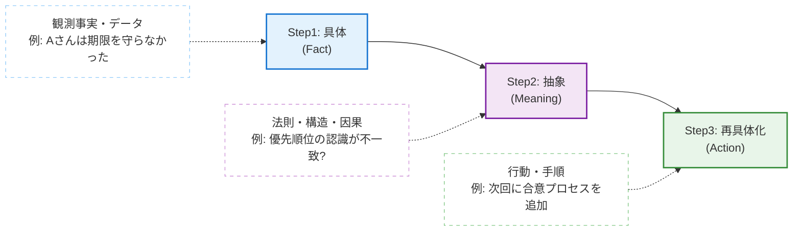
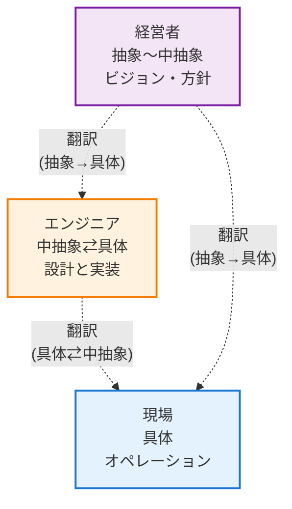

「なんでこんなに具体的に説明しているのに伝わらないんだ？」  
「あの人の話はフワッとしていて、結局何をしていいかわからない」

仕事や日常生活で感じるコミュニケーションのズレ。その正体のほとんどは、どうやら**「具体」と「抽象」というレベル（階層）の違い**にあるように思う。

私たちは普段、無意識にこの2つの世界を行き来しているが、意識的にコントロールできている人は案外少ないのかもしれない。今回は、知性の正体とも言える「具体と抽象」のメカニズムについて、自分なりに整理してみたい。

---

## 1. 思考の「縦」と「横」

まず前提として、具体と抽象は**「相対関係」**で決まるものだ。絶対的なものではない。

- **具体（下流）**：実体がある。五感で感じられる。情報の解像度が高い（数字、固有名詞）。
- **抽象（上流）**：実体がない。概念、法則、クラス。情報の解像度が低い。

これをツリー構造でイメージしてみよう。一番下が無限に広がる「具体」の葉っぱ、上に登るほど集約された「抽象」の幹になる。

知識量だけで勝負する世界（歴史の年号など）は「横」の広がりだが、知性や理解力が必要な世界（数学など）は「縦」の移動だと言える。

学年が上がるにつれて数学についていけなくなる人が増えるのは、抽象度が上がり、高度な概念操作が必要になるからかもしれない。

---

## 2. 現代人を蝕む「2つの偏り」

この具体と抽象、どちらかに偏りすぎると、いわゆる「病」のような状態に陥りやすい。

### ① 抽象病（フワッとしている人）

「本質的には〜」「シナジーが〜」と口では立派なことを言うものの、具体的なアクションに落ちない状態。

「要するに何？」と聞かれても答えられず、口だけで成果が出ない。抽象の世界だけで回遊してしまっているケースだ。

### ② 具体病（指示待ちロボット）

「具体的に指示されないと動けません」という状態。一見真面目に見えるが、思考停止に陥っている可能性がある。

独自の解釈や応用ができず、言われたことしかできないため、いずれAIや機械に代替されるリスクが高い。

---

## 3. 知性とは「認知体力」を使う往復運動

では、どうすればいいのか。答えはシンプルで**「往復すること」**だと思う。

ただ、これが実に難しい。なぜなら、往復運動は脳のエネルギー（認知資源）を激しく消費するからだ。

- **具体に留まる**：脳の負荷が低い（見たままを話せばいい）。
- **抽象に逃げる**：現実検証を避けられる（責任を負わなくていい）。
- **往復する**：最も疲れる。

「話が噛み合わない」「思考が浅い」と感じる原因は、能力不足というより、単にこのコストを払う体力（認知体力）を惜しんでいることが多いのかもしれない。

優秀な人とは、この知的負荷に耐えうる足腰を持っている人のことを言うのかもしれない。

---

## 往復の黄金ルート「3ステップモデル」

効果的な往復には型があるらしい。以下の3段階を意識するだけで、思考の質が少し変わってくるかもしれない。

### Step1：具体（Fact）
観測事実・データ。  
「Aさんは期限を守らなかった」

### Step2：抽象（Meaning）
法則・構造・因果。  
「優先順位の認識がチーム内で不一致だったのではないか？」

### Step3：再具体化（Action）
行動・手順。  
「次回キックオフで優先順位の合意プロセスをアジェンダに入れる」

多くの議論は、Step1だけで井戸端会議になるか、Step2だけで「意識合わせしよう」という机上の空論で終わりがちだ。

:::message important
**重要**: Step3（再具体化）まで着地して初めて、往復運動は完結する。
:::

---

## 4. 組織論：職種とは「扱うレイヤー」の違い

この視点は、組織のコミュニケーション不全も説明してくれる。職種によって、主戦場とする抽象度（レイヤー）が異なるからだ。

- **経営者**：抽象〜中抽象（ビジョン、方針）
- **現場**：具体（オペレーション、顧客対応）
- **エンジニア**：中抽象⇄具体（設計と実装の反復）

:::message tip
話が通じないのは、能力の差ではなく**「レイヤーの不一致」**であることが多い。優秀なビジネスパーソンは、「レイヤー間の翻訳家」として振る舞う。
:::

相手が現場なら具体に翻訳し、経営層なら抽象に翻訳して伝える。この翻訳能力が、組織における信頼の正体なのかもしれない。

### 具体例：経営層と現場の会話

#### ❌ 噛み合わない例

**経営層**：「顧客体験を向上させよう」（抽象）  
**現場**：「具体的に何をすればいいですか？」（具体を要求）  
**経営層**：「だから、顧客満足度を高めるんだよ」（抽象のまま）  
**現場**：「…はい」（理解できず、行動に移せない）

#### ✅ 翻訳した例

**経営層**：「顧客体験を向上させるため、問い合わせ対応時間を現在の平均2時間から30分以内に短縮しよう」（抽象→具体）  
**現場**：「了解です。チャットボット導入とFAQの充実を検討します」（具体→行動）  
**経営層**：「良いね。それで顧客の待ち時間ストレスが減る」（行動→抽象で意味を確認）

### 具体例：エンジニア間の会話

#### ❌ 具体病の例

**先輩**：「このコード、もっと保守性を高められないか？」（中抽象）  
**後輩**：「具体的にどの行を変えればいいですか？」（具体のみ）  
**先輩**：「それを考えるのが君の仕事だよ…」（フラストレーション）

#### ✅ 往復できる例

**先輩**：「このコード、もっと保守性を高められないか？」（中抽象）  
**後輩**：「保守性というと、例えば関数の責務が大きすぎるということでしょうか？」（抽象→具体への翻訳を試みる）  
**先輩**：「そう！特に50行のこの関数を、データ取得とビジネスロジックに分割できないか？」（具体に落とす）  
**後輩**：「なるほど、単一責任の原則ですね。分割します」（抽象の法則を理解）

---

## 5. 抽象は「武器」にも「詭弁」にもなる

最後に、自戒を込めて抽象化のダークサイドについても触れておきたい。

抽象化は複雑な事象をシンプルにする強力な武器だが、同時に責任を曖昧にする詭弁としても機能してしまう。

例えば失敗した時に、「今回は大きな学び（抽象）があったからOK」とまとめてしまうのは、もしかすると抽象への逃避なのかもしれない。

:::message warning
**警告**: 具体的な失敗原因（Fact）と対策（Action）から目を背けるために、抽象（Meaning）を利用してはならない。
:::

---

## 6. AI時代に残る人間の知性

AIは計算速度、つまり「具体⇄抽象の往復速度」においては人間を凌駕していくだろう。膨大な具体データから法則を見つける速度では、人間は勝てそうにない。

ただ、**「どの高さ（抽象度）のレイヤーを採用するか」**という選択は、文脈や価値観、美意識に依存するため、当面は人間の領域として残るのではないだろうか。

- **AI**：速く、正確に往復する。
- **人間**：どの高さで話すべきか、その「目的」を選ぶ。

---

## まとめ：知性を磨く、地味だけど確実な習慣

魔法のような解決策はない。あるのは、日々の地味な「往復運動」だけだと思う。

明日からできそうなことを、いくつか挙げてみる。

### 「いま、どこ？」と現在地を確認する

話が噛み合わない時、相手を責める前に「いま、どの高さ（抽象度）で話している？」と心の中で問い直してみる。

これだけで、無駄な衝突は減るかもしれない。

### あえて「宣言」して、梯子をかける

「これは抽象的な話だけど」「具体的に言うと」と、自分が移動する合図を出してみる。

そうすれば、相手も一緒に思考の梯子を登り降りしやすくなるだろう。

### 「Fact→Meaning→Action」で着地する

事実を並べるだけでも、精神論を語るだけでも不十分だ。

できるだけ「事実」から意味を汲み取り、「次の行動」まで落とし込んで会話を終える癖をつけていきたい。

### 苦手な側こそ、意識的に踏み込む

具体が得意なら「つまり？」と要約し、抽象が得意なら「例えば？」と具体例を出してみる。

脳が汗をかいている感覚があれば、それこそが成長痛だと思って、少し楽しんでみてもいいかもしれない。

---

知性とは、静止画ではなく動画のようなものなのかもしれない。

具体という「足」で地面を泥臭く踏みしめながら、抽象という「翼」で空から冷静に全体を見る。

このダイナミックで疲れる往復運動を、汗をかきながら続けていく。その先に、少しだけ新しい景色が見えてくるかもしれない。
