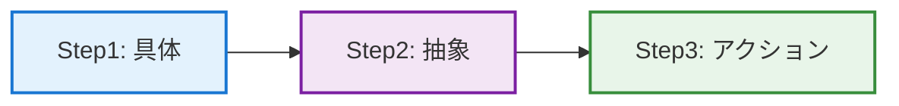
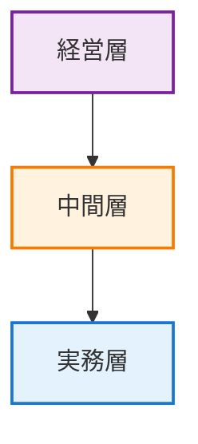

「具体と抽象」に関する本を読んだ。具体と抽象についての学びを備忘する。
コミュニケーションがうまくいかない原因の多くは、**「具体」と「抽象」という思考のレベルが違う**ことにある。

---

## 1. 「具体」と「抽象」は階段のようなもの

具体と抽象は**相対的な関係**であり、絶対的な基準があるわけではない。

例えば、以下のような階層がある：

- **レベル1（超具体）**：「2024年1月に東京で開催されたReact勉強会」
- **レベル2（具体）**：「React勉強会」
- **レベル3（中抽象）**：「技術勉強会」
- **レベル4（抽象）**：「学習機会」
- **レベル5（超抽象）**：「成長」

同じ「React勉強会」でも、「2024年1月の東京開催」と比べれば抽象的だし、「学習機会」と比べれば具体的だ。

**知識を増やすのは「横」に広げる作業で、理解を深めるのは「縦」に移動する作業**。歴史の年号を覚えるのは横の拡張。「なぜその出来事が起きたのか」を考えるのは縦の移動である。

---

## 2. 話が通じない2つのパターン

現場でよく見かける、コミュニケーションがうまくいかないパターンが2つある。

### パターン1：ふわふわしすぎて何も進まない

会議でよく聞く言葉：「ユーザー体験を最適化しよう」「パフォーマンスを最適化しよう」

聞こえはいいが、「で、明日何すればいいのか？」と聞かれて答えられないなら、それは空論である。

### パターン2：言われたことしかできない

逆のパターンもある。「この手順通りにやってください」と指示されたことだけをこなす状態。

新しい状況に遭遇すると、「それは教わってないのでできません」で止まる。マニュアル通りにしか動けないなら、いずれAIに仕事を奪われる。

大事なのは、**具体的な経験から「なぜそうするのか」という原則を学び、それを新しい状況に応用できること**である。

---

## 3. 階段の上り下りは、めちゃくちゃ疲れる

じゃあどうすればいいのか。シンプルに言えば**「具体と抽象を行ったり来たりする」**こと。

ただ、これが本当に大変だ。実際にやると、脳がめちゃくちゃ疲れる。

- **具体だけで話す**：楽。目の前の事実を並べればいい。「Aさんが遅刻した」「Bさんもミスした」
- **抽象だけで話す**：これも楽。責任を取らなくていい。「チームの意識改革が必要だ」
- **両方を行き来する**：超疲。「なぜ遅刻が起きたのか？」「どう改善する？」と考え続ける必要がある。

「あの人話が浅いな」と感じるとき、それは能力の問題ではなく、**この疲れる作業をサボってる**だけのことが多い。

逆に、「この人すごいな」と思う人は、この上り下りを当たり前のようにやっている。それが習慣になっている。

---

## 往復の黄金ルート「3ステップモデル」

実践で有効な「3ステップ思考法」。

| Step | 内容 | 例 |
|:---:|:---|:---|
| **Step1** | 事実を確認する | APIのレスポンスが500ms→1200msに増加 |
| **Step2** | 原因を考える | N+1クエリが発生している |
| **Step3** | アクションに落とす | 今週中にクエリを最適化 |

### Step1：まず事実を確認する

感情や推測を排除して、**何が起きたのか**を正確に把握する。

例：「先週のリリース後、APIのレスポンスタイムが平均500msから1200msに増加した」

### Step2：パターンや原因を考える

**なぜそれが起きたのか**、背後にある構造や法則を探る。

例：「新機能でN+1クエリが発生している。データベース設計の見直しが必要かもしれない」

### Step3：具体的なアクションに落とす

**次に何をするか**を明確にする。ここまでやって初めて完結。

例：「今週中にクエリを最適化し、来週のスプリントでキャッシュ戦略を検討する」

多くの会議が生産的じゃないのは、Step1で事実を並べるだけで終わるか、Step2で「意識を変えよう」みたいな精神論で終わるからだ。

:::message important
**重要**: Step3（具体的なアクション）まで落として初めて、思考が完結する。
:::

---

## 4. 職種によって「住んでる階」が違う

職種によって、**普段いる思考の階層が違う**。

| 層 | 思考のレベル | 具体例 |
|:---:|:---|:---|
| **経営層** | 抽象的（ビジョン・戦略） | 「市場での競争優位性を確立する」 |
| **中間層** | 抽象⇄具体の翻訳 | 方針を施策に、施策を作業に変換 |
| **実務層** | 具体的（日々のタスク） | 「このバグを今日中に直す」 |

- **経営層**：「市場での競争優位性を確立する」みたいな抽象的な話が中心
- **実務層**：「このバグを今日中に直す」みたいな具体的なタスクが中心
- **中間層**：両方の言語を話せる必要がある

:::message tip
話が通じないのは、能力の差ではなく**「住んでる階が違う」**だけのことが多い。優秀な人は、相手の階に降りたり登ったりできる人。
:::

中間層に求められるのは「翻訳者」の役割。経営層の抽象的なビジョンを、実務層が動ける具体的なタスクに変換する。逆に、現場の具体的な課題を、経営層が理解できる抽象的な言葉で報告する。

---

## 5. 抽象化は「逃げ道」にもなる

抽象化は便利なツールだが、**責任逃れの道具**にもなる。

プロジェクトが失敗したとき、「今回は貴重な学びがあった」「チームの成長に繋がった」と抽象的な言葉でまとめ、具体的な失敗原因の分析から目を背ける。これはよくあるパターンだ。

:::message warning
**警告**: 「学び」「成長」という抽象的な言葉で、具体的な失敗原因と対策から逃げてはいけない。
:::

本当に向き合うなら：
- **具体的な失敗**：「要件定義が不十分で、3回も仕様変更が発生した」
- **原因の分析**：「ステークホルダーとの認識合わせが甘かった」
- **具体的な対策**：「次回から週次で認識合わせMTGを設定する」

ここまでやって初めて、「学び」と言える。

---

## 6. AIと人間の役割分担

AIは「具体⇄抽象の往復スピード」では人間を完全に超えていく。膨大なデータから一瞬でパターンを見つけ、抽象的な法則を導き出す。この速度では人間は勝負にならない。

一方、人間にしかできないことがある。それは**「どの階層で考えるべきか」を選ぶこと**。

例えば、顧客からのクレームに対して：
- 超具体的に対応：「この件だけ個別に返金」
- 中抽象で考える：「返金ポリシーを見直す」
- 超抽象で考える：「顧客体験の根本的な再設計」

どのレベルで対応するかは、ビジネスの状況、リソース、企業の価値観によって変わる。この判断は人間の領域だ。

- **AIの強み**：高速で正確な往復運動
- **人間の強み**：「今、どの高さで考えるべきか」という判断

---

## 4つの実践習慣

### 1. 「今どの階にいる？」と自問する

会話が噛み合わないとき、「自分は具体的な話をしているか？抽象的な話をしているか？相手は？」と確認する。これだけで無駄な衝突が減る。

### 2. 移動するときは「予告」する

「抽象的な話になるけど」「具体的に言うと」と一言添えることで、相手がついてきやすくなる。

### 3. 「事実→原因→行動」で終わる

- 事実だけ並べて終わらない
- 理想論だけ語って終わらない
- 必ず「で、次何する？」まで落とす

### 4. 苦手な方向に意識的に動く

具体的な話が得意なら「つまりこれって何のため？」と抽象化する。抽象的な話が得意なら「例えば？」と具体例を出す。

---

具体と抽象の往復は、思考の基本操作である。これを意識的に繰り返すことで、コミュニケーションの質が変わる。

---

## 参考文献

- 細谷 功『[具体と抽象](https://www.amazon.co.jp/dp/4844376578)』（dZERO）
- 細谷 功『[「具体⇔抽象」トレーニング 思考力が飛躍的にアップする29問](https://www.amazon.co.jp/dp/B0868GMSBG)』（PHPビジネス新書）
