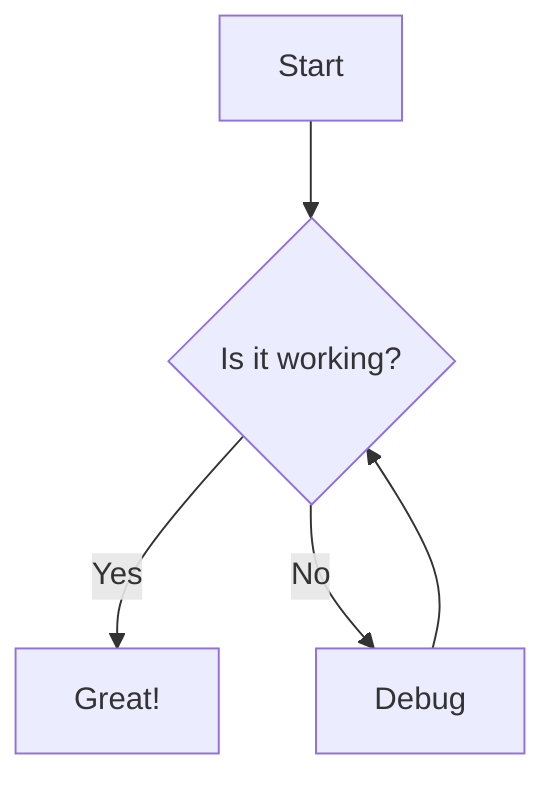

## このScrapについて

Scrap機能でサポートされるマークダウン記法をテストします。ブログ詳細ページと同じ記法が使えます。

---

## 基本記法

### テキスト装飾
**太字**、*斜体*、~~取り消し線~~、***太字斜体***

### 引用
> "Design is not just what it looks like and feels like. Design is how it works."
> — Steve Jobs

### タスクリスト
- [x] Scrap機能の実装
- [x] マークダウン対応
- [ ] 追加機能の検討

---

## コードブロック

TypeScriptのサンプル：

```tsx:Counter.tsx
import { useState } from 'react';

export const Counter = () => {
    const [count, setCount] = useState(0);
    return <button onClick={() => setCount(count + 1)}>{count}</button>;
};
```

---

## GitHub Alerts

> [!NOTE]
> これはNOTEアラートです。

> [!TIP]
> これはTIPアラートです。

> [!WARNING]
> これはWARNINGアラートです。

---

## 数式

インライン数式: $E = mc^2$

ブロック数式:

$$
\frac{1}{n} \sum_{i=1}^{n} x_i
$$

---

## Mermaid図



---

## 埋め込み

### YouTube
@[youtube](dQw4w9WgXcQ)

### GitHub
@[github](Ryota-Onuma/me)

---

## メッセージボックス

:::message
これは標準メッセージボックスです。
:::

:::message alert
これはアラートメッセージボックスです。
:::

---

## アコーディオン

:::details 詳細を見る
隠れた内容がここに表示されます。**マークダウン**も使えます！
:::
