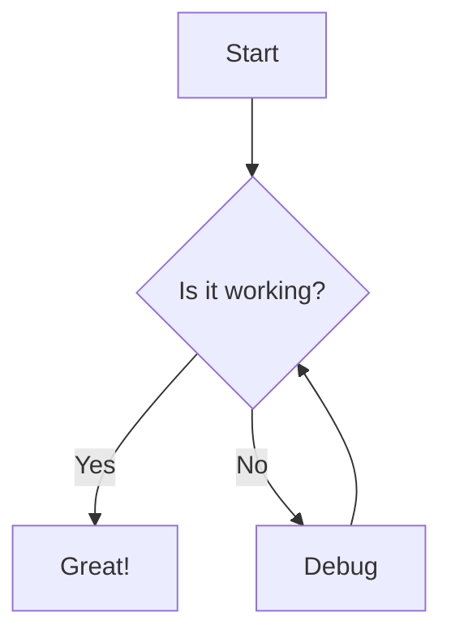

Welcome to the Markdown and Syntax Highlighting guide. This post serves as a test suite for our rendering engine to ensure everything looks premium and consistent.

## Typography and Basic Elements

### Headings
Headings from H1 to H6 should have distinct sizes and weights. This is an **H3**, and below is an **H4**.

#### Paragraphs and Formatting
You can use **bold text** for emphasis, *italicized text* for subtle highlights, or even ~~strikethrough~~. Combining them like ***bold and italic*** should also work flawlessly.

> "Design is not just what it looks like and feels like. Design is how it works."
> — Steve Jobs

---

## Lists and Tables

### Task Lists
- [x] Implement syntax highlighting
- [x] Add smooth transitions
- [ ] Optimize image loading

### Unordered and Ordered Lists
1. First item
2. Second item
   - Sub-item A
   - Sub-item B
3. Third item

### Data Tables
| Feature | Supported | Notes |
| :--- | :---: | :--- |
| GitHub Flavored Markdown | Yes | Including tables and task lists |
| Syntax Highlighting | Yes | Powered by Prism.js |
| Mermaid Diagrams | Yes | Flowcharts, sequence diagrams |
| KaTeX Math | Yes | Inline and block equations |

---

## GitHub-style Alerts

> [!NOTE]
> This is a note alert. It should have a blue theme and an info icon.

> [!TIP]
> This is a tip alert. It should have a green theme and a lightbulb icon.

> [!IMPORTANT]
> This is an important alert. It should have a purple theme and a zap icon.

> [!WARNING]
> This is a warning alert. It should have an amber theme and a triangle icon.

> [!CAUTION]
> This is a caution alert. It should have a red theme and a circle-x icon.

---

## Code and Syntax Highlighting

### Inline Code
You can use `inline code` for variable names or short commands like `npm run dev`.

### Code Blocks
Our engine supports various languages with a "Copy" button UI.

#### TypeScript (TSX) with Line Highlighting
```tsx:Counter.tsx{3,5-6}
import React, { useState } from 'react';

export const Counter = () => {
    const [count, setCount] = useState(0);
    
    return (
        <button onClick={() => setCount(count + 1)}>
            Count is: {count}
        </button>
    );
};
```

#### CSS (with filename)
```css:layout.css
.container {
    display: flex;
    justify-content: center;
}
```

#### Bash
```bash
# Install dependencies
npm install

# Start development server
npm run dev
```

#### JSON
```json
{
  "name": "my-blog",
  "version": "1.0.0",
  "private": true
}
```

#### Python
```python:example.py
def hello_world():
    print("Hello, World!")

if __name__ == "__main__":
    hello_world()
```

#### Rust
```rust:main.rs
fn main() {
    println!("Hello, Rust!");
}
```

#### Kotlin
```kotlin:Main.kt
fun main() {
    val message = "Hello, Kotlin!"
    println(message)
    
    val numbers = listOf(1, 2, 3, 4, 5)
    val doubled = numbers.map { it * 2 }
    println(doubled)
}
```

#### SQL
```sql
SELECT * FROM users WHERE active = true;
```

---

## Mathematical Expressions

Inline math: $E = mc^2$

Block math:

$$
\frac{1}{n} \sum_{i=1}^{n} x_i
$$

---

## Mermaid Diagrams



---

## Details and Summary

<details>
<summary>Click to see more</summary>

This is hidden content inside a details tag. It supports markdown too!
- Item 1
- Item 2

</details>

---

## Media

### Images
Images should be responsive and centered.


*Figure: This is a caption for the image.*

---

## Conclusion

If all elements above render correctly with beautiful spacing and crisp colors, the blog engine is ready for production-grade content!
