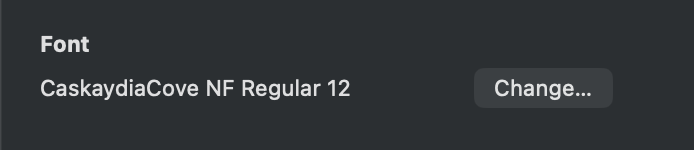

# Shell & Terminal Setup

開発環境のシェル・ターミナル設定一式。Ghostty + Zsh (Oh My Zsh) + Starship + Neovim の構成。

---

## 📦 Install / インストール

### Ghostty

```sh
brew install --cask ghostty
```

Open Ghostty settings and copy `brain/ghostty/config`

### Oh My Zsh + Zsh plugins

```sh
sh -c "$(curl -fsSL https://raw.githubusercontent.com/ohmyzsh/ohmyzsh/master/tools/install.sh)"

touch brain/shell/.private.zsh
cp brain/shell/.private.zsh ~/.private.zsh
cp brain/shell/.zshrc ~/.zshrc
```

### Starship + Font

```sh
brew install starship
brew install --cask font-caskaydia-cove-nerd-font
mkdir ~/.config
cp brain/shell/starship.toml ~/.config/starship.toml
```

### Change terminal font configuration to use font-caskaydia-cove-nerd-font



### Neovim

```sh
brew install neovim
mkdir -p ~/.config/nvim/
cp brain/nvim/init.lua ~/.config/nvim/init.lua
```

### tmux

```sh
brew install tmux
cp brain/shell/.tmux.conf ~/.tmux.conf
git clone https://github.com/tmux-plugins/tpm ~/.tmux/plugins/tpm
```

### Utilities

```sh
brew install bat
brew install eza
brew install fzf
$(brew --prefix)/opt/fzf/install
```

---

## 🔄 Update files / 設定ファイルの更新

```sh
cp brain/shell/.private.zsh ~/.private.zsh && \
cp brain/shell/.zshrc ~/.zshrc && \
cp brain/shell/starship.toml ~/.config/starship.toml && \
cp brain/nvim/init.lua ~/.config/nvim/init.lua && \
cp brain/shell/.tmux.conf ~/.tmux.conf
```

または `reload()` 関数を使う（後述）。

---

## ⌨️ Shell Aliases / エイリアス

### General / 一般

| Alias | 展開 | 説明 |
|---|---|---|
| `vim` | `nvim` | Neovim を起動 |
| `cl` | `clear` | 画面クリア |
| `zshrc` | `vim ~/.zshrc` | zshrc を編集 |
| `mv` | `mv -iv` | 確認付きで移動 |
| `rm` | `rm -i` | 確認付きで削除 |
| `mux` | `tmuxinator` | Tmuxinator |

### File Management / ファイル操作

| Alias | 展開 | 説明 |
|---|---|---|
| `ls` | `eza --icons` | アイコン付き一覧 |
| `ll` | `eza -l --icons` | 詳細表示 |
| `la` | `eza -la --icons` | 隠しファイル含む詳細 |
| `cat` | `bat --paging=never` | シンタックスハイライト付き表示 |

### Navigation / ナビゲーション

| Alias | 展開 | 説明 |
|---|---|---|
| `cdd` | `cd ~/desktop` | Desktop へ移動 |
| `cdme` | `cd ~/desktop/dev/me` | このリポジトリへ移動 |

### Git

| Alias | 展開 |
|---|---|
| `gs` | `git status` |
| `gco` | `git checkout` |
| `gcob` | `git checkout -b` |
| `gf` | `git fetch` |
| `gm` | `git merge` |
| `gl` | `git log --oneline` |
| `gp` | `git push` |
| `gri` | `git rebase -i` |
| `gc` | `git commit` |
| `gb` | `git branch` |

### Docker

| Alias | 展開 |
|---|---|
| `dc` | `docker compose` |
| `dup` | `docker compose up` |
| `dce` | `docker compose exec` |

---

## 🔧 Shell Functions / 関数

### `reload()`

`brain/` 以下の設定ファイルをホームディレクトリへ同期し、zsh をリロードする。

```sh
reload
```

同期される内容:
- `brain/shell/.zshrc` → `~/.zshrc`
- `brain/shell/.private.zsh` → `~/.private.zsh`
- `brain/.claude/agents/` → `~/.claude/agents/`
- `brain/.claude/commands/` → `~/.claude/commands/`
- `brain/.claude/skills/` → `~/.claude/skills/`
- `brain/.claude/settings.json` → `~/.claude/settings.json`

---

## 🖥️ Ghostty Keybindings / Ghostty キーバインド

Ghostty は `Cmd+key` を kitty keyboard protocol の CSI u シーケンスとして Neovim に転送する。
これにより、macOS の `Cmd+key` を Neovim のキーマップ (`<D-*>`) に割り当てられる。

| Ghostty Key | 転送先 Neovim Action |
|---|---|
| `Cmd+P` | Find files / ファイル検索 |
| `Cmd+Shift+P` | Command palette / コマンドパレット |
| `Cmd+F` | Find (Live Grep) / 全文検索 |
| `Cmd+Shift+F` | Global search / 全文検索 |
| `Cmd+Shift+O` | Go to symbol / シンボルへジャンプ |
| `Cmd+S` | Save file / ファイル保存 |
| `Cmd+W` | Close buffer / バッファを閉じる |
| `Cmd+Z` | Undo / 元に戻す |
| `Cmd+Shift+Z` | Redo / やり直し |
| `Cmd+A` | Select all / 全選択 |
| `Cmd+Shift+K` | Delete line / 行を削除 |
| `Cmd+/` | Toggle comment / コメント切替 |
| `Cmd+B` | Toggle file tree / ファイルツリー切替 |
| `Cmd+J` | Toggle terminal / ターミナル切替 |
| `Cmd+.` | Code action / コードアクション |
